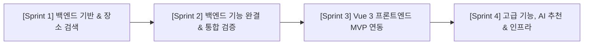

# Project Roadmap & Documentation Guide (ROADMAP.md)

Staff Software Architect 관점에서 작성한 **PetSpot 프로젝트의 문서별 역할 및 단계별 실행 로드맵 (v2.0)** 문서입니다.

---

## 1. 문서별 역할 및 담당 범위

```
pet-friendly/
├── SYSTEM_DESIGN.md       ─── [통합 명세 참조] PRD, 도메인, 아키텍처를 총망라한 Master Spec
├── README.md              ─── [온보딩] 프로젝트 개요 및 전체 문서 지침(Index) 파일
└── docs/
    ├── PRODUCT.md         ─── [기획/비즈니스] 제품 비전, 페르소나, Epic 및 User Story
    ├── DOMAIN.md          ─── [도메인/비즈니스 로직] 데이터 모델 (TS Types) & 스마트 매칭 계산 규칙
    ├── TECH_STACK.md      ─── [인프라/아키텍처] Vue 3, Spring Boot 3, PostGIS, Redis 스펙 및 C4 구조
    ├── RULES.md           ─── [컨벤션/가이드라인] TypeScript Strict 규칙, Vue3/Spring 코드 구조 & UI 규정
    ├── TASKS.md           ─── [진행 상태 관리] Phase/Sprint별 마일스톤 및 설계/구현 검증 체크리스트
    ├── DECISIONS.md       ─── [아키텍처 이력] ADR (대표 펫 매칭, Vue3/Spring3/TS 채택 사유 등)
    └── ROADMAP.md         ─── [실행 로드맵] 문서 역할 및 Step-by-Step 프로젝트 진행 가이드
```

---

## 2. 단계별 프로젝트 진행 로드맵 (Execution Roadmap v2.0)

실제 서비스 MVP 조기 가동을 위해 **"백엔드 기능 완결(Sprint 2) ➔ 프론트엔드 MVP 실서비스 구축(Sprint 3) ➔ 고도화 및 AI/인프라(Sprint 4)"** 순서로 로드맵을 재구성했습니다.



---

### 📍 Sprint 1: 백엔드 기반 & 장소 공간 검색 (COMPLETED)
1. **인프라 & 스키마 초기화**: PostgreSQL + PostGIS Docker 설정, Flyway DDL 적용 (`users`, `pets`, `places`).
2. **공공데이터 파이프라인**: TourAPI REST Client 및 파싱 배치 기능 구축.
3. **장소 검색 API**: QueryDSL Spatial 기반 반경/카테고리/동반 수칙 다중 필터 및 Pageable 페이징 API 구축.

---

### 📍 Sprint 2: 백엔드 기능 완결 & 통합 검증 (Backend Feature Completion)
1. **Review Service & REST API**:
   - Review CUD, `Place` 평균 평점 (`rating`) 및 리뷰 수 (`reviewCount`) 실시간 동기화, Swagger 문서화 및 409 Conflict 중복 방지.
2. **My Page API**:
   - 사용자 프로필, 대표 반려동물, 즐겨찾기 목록, 내 리뷰 목록, 내 반려동물 목록 일괄 조회 API.
3. **Dashboard API**:
   - 메인 홈 화면용 추천 장소, 인기 장소, 최근 등록 장소, 대표 반려동물 통합 조회 API.
4. **Integration Test (통합 테스트)**:
   - 회원가입 ➔ 로그인 ➔ JWT 발급 ➔ Pet 등록 ➔ Favorite 등록 ➔ Review 작성 ➔ Place Rating 변경 ➔ 마이페이지 조회 전체 E2E Flow 검증.
5. **API Documentation**:
   - Swagger OpenAPI 3.0 명세 정리, API Tag 분류, Request/Response/Error 명확한 예시 작성.

> [!NOTE]
> **Sprint 2 종료 후 기술부채(Refactoring Sprint) 관리 항목**:
> `ST_DWithin` 최적화, Pagination 확장, QueryDSL 개선, Domain/Application Layer 정제, Exception 구조 개편, Performance Tuning은 별도 리팩토링 스프린트에서 수행합니다.

---

### 📍 Sprint 3: 프론트엔드 MVP 실서비스 구축 (Frontend MVP Sprint)
- **목표**: Vue 3 + Vite 기반 프론트엔드 개발 및 백엔드 API와의 완전한 연동을 통해 실제 동작하는 MVP 서비스 구축.
- **기술 스택**: Vue 3 (Composition API), Vite, Pinia, Vue Router 4, Axios, TailwindCSS, JWT Authentication, 반응형 UI.
- **Frontend 설계 문서 작성**: Frontend Architecture, Component Tree, API Mapping, Routing, Pinia Store, Axios 구조, 공통 Layout 설계.
- **구현 대상 화면**:
  1. 로그인 (`/login`): JWT 저장, 자동 로그인, 로그아웃
  2. 회원가입 (`/signup`): Validation, 이메일 중복 확인
  3. 홈 (`/`): 추천 장소, 인기 장소, 최근 등록 장소, 대표 반려동물 렌더링
  4. 장소 검색 (`/places`): 키워드 검색, 카테고리 필터, 반려동물 조건, 거리순 정렬
  5. 지도 (`/map`): Kakao Map / Leaflet 연동, 현재 위치 마커, 장소 상세 모달/페이지 이동
  6. 장소 상세 (`/places/{id}`): 기본 정보, 사진, 리뷰 목록, 즐겨찾기 토글, 리뷰 작성
  7. 즐겨찾기 (`/favorites`): 즐겨찾기 장소 목록 및 삭제
  8. 내 반려동물 (`/pets`): 펫 CRUD 및 대표 반려동물 스위칭 설정
  9. 마이페이지 (`/mypage`): 회원 정보, 즐겨찾기 탭, 내 리뷰 탭, 내 반려동물 탭

---

### 📍 Sprint 4: 고급 기능, AI 추천 & 인프라 (Advanced AI & Infra Sprint)
- **주요 구현 항목**:
  - OpenAI / AI 기반 펫 맞춤형 추천 알고리즘
  - Redis Cache (장소 검색 및 세션/토큰 캐싱)
  - Elasticsearch (초고속 전문 검색 엔진)
  - AWS 인프라 배포, Docker Compose Production 구축, CI/CD 파이프라인 및 Prometheus/Grafana 모니터링
