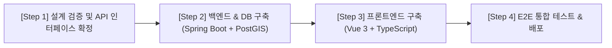

# Project Roadmap & Documentation Guide (ROADMAP.md)

Staff Software Architect 관점에서 작성한 **PetSpot 프로젝트의 문서별 역할 및 단계별 실행 로드맵** 문서입니다.

---

## 1. 문서별 역할 및 담당 범위

```
pet-friendly/
├── SYSTEM_DESIGN.md       ─── [통합 명세 참조] PRD, 도메인, 아키텍처를 총망라한 Master Spec
├── README.md              ─── [온보딩] 프로젝트 개요 및 전체 문서 지침(Index) 파일
└── docs/
    ├── PRODUCT.md         ─── [기획/비즈니스] 제품 비전, 페르소나, Epic 및 User Story
    ├── DOMAIN.md          ─── [도메인/비즈니스 로직] 데이터 모델 (TS Types) & 스마트 매칭 계산 규칙
    ├── TECH_STACK.md      ─── [인프라/아키텍처] Vue 3, Spring Boot 3, PostGIS, Redis 스펙 및 C4 구조
    ├── RULES.md           ─── [컨벤션/가이드라인] TypeScript Strict 규칙, Vue3/Spring 코드 구조 & UI 규정
    ├── TASKS.md           ─── [진행 상태 관리] Phase별 마일스톤 및 설계/구현 검증 체크리스트
    ├── DECISIONS.md       ─── [아키텍처 이력] ADR (대표 펫 매칭, Vue3/Spring3/TS 채택 사유 등)
    └── ROADMAP.md         ─── [실행 로드맵] 문서 역할 및 Step-by-Step 프로젝트 진행 가이드
```

### 각 문서의 상세 역할
- **`SYSTEM_DESIGN.md`**: 제품의 모든 기술 및 비즈니스 명세를 한 번에 조망할 수 있는 **마스터 종합 참조 문서**입니다.
- **`docs/PRODUCT.md`**: **"무엇을(What) 왜(Why) 만드는가?"**를 정의합니다. 소형견/대형견/응급진료 집사의 Pain Point와 유저 스토리 명세가 포함됩니다.
- **`docs/DOMAIN.md`**: **"어떤 비즈니스 규칙과 데이터 구조인가?"**를 정의합니다. DB 스키마, 프론트엔드 TypeScript Interface, 3단계 매칭 알고리즘(`PASS`/`WARN`/`DENY`)을 명시합니다.
- **`docs/TECH_STACK.md`**: **"어떤 기술로(How) 가동할 것인가?"**를 정의합니다. Vue 3 + Vite, Spring Boot 3 + JPA/QueryDSL, PostGIS, Redis 아키텍처 및 NFR 성능 목표(P95 < 50ms)를 담고 있습니다.
- **`docs/RULES.md`**: **"개발팀이 따라야 할 코딩 규칙은 무엇인가?"**를 정의합니다. TypeScript No `any` 정책, Component `<script setup lang="ts">`, Spring Boot 레이어드 패키지 구조, REST API 응답 규격을 규정합니다.
- **`docs/TASKS.md`**: **"지금 어떤 단계이며 무엇을 검증해야 하는가?"**를 추적합니다. Phase 1~4 진행도 및 검증 항목을 관리합니다.
- **`docs/DECISIONS.md`**: **"과거에 왜 이러한 아키텍처 선택을 했는가?"**를 기록하는 ADR(Architecture Decision Record) 모음입니다.
- **`docs/ROADMAP.md`**: **"어떤 순서로 프로젝트를 실행 및 검증하는가?"**를 정의하는 단계별 실행 가이드입니다.

---

## 2. 단계별 프로젝트 진행 로드맵 (Execution Roadmap)

아키텍트 관점에서 **"설계 검증 ➔ 백엔드/데이터 파이프라인 ➔ 프론트엔드 ➔ 통합 검증"** 순서로 진행합니다.



---

### 📍 Step 1: 설계 검증 및 OpenAPI 계약 확정 (Design & API Contract)
1. **공공데이터 OpenAPI 스펙 매핑**:
   - 한국관광공사 TourAPI 및 공공데이터포털 장소 데이터 표준 컬럼을 `Place` 엔티티 구조와 1:1 매핑 검증.
2. **REST API Swagger/OpenAPI 스펙 작성**:
   - `/api/v1/places` (검색 및 반경 조회)
   - `/api/v1/pets` (펫 프로필 CRUD)
   - `/api/v1/places/{id}/evaluate` (매칭 알고리즘 API)

---

### 📍 Step 2: 백엔드 & 공공데이터 파이프라인 구축 (Spring Boot 3 + PostGIS)
1. **PostgreSQL & PostGIS 데이터베이스 설정**:
   - `GEOMETRY(Point, 4326)` Spatial Index 및 JPA/Hibernate Spatial 연동.
2. **공공데이터 배치 인제스천 서비스 (`@Scheduled`)**:
   - 공공데이터포털 API 파싱 ➔ 펫 동반 정책 데이터 정제 및 DB Upsert 파이프라인.
3. **Spring Boot 핵심 REST API 구현**:
   - QueryDSL 기반 위치/카테고리/견종 크기 다중 필터링 쿼리.
   - Spring Security + JWT 인증 및 펫 매칭 서비스 로직 구현.

---

### 📍 Step 3: 프론트엔드 구축 (Vue 3 + TypeScript)
1. **Vue 3 + Vite + TypeScript 프로젝트 초기화**:
   - `@/types/` 하위 타입 정의 (`user.ts`, `place.ts`, `pet.ts`).
2. **Pinia 전역 스토어 구축**:
   - `useAuthStore` (회원 로그인/JWT 관리)
   - `usePetStore` (펫 프로필 등록 및 대표 펫 변경 이벤트)
   - `usePlaceStore` (필터링 및 지도 마커 상태)
3. **컴포넌트 개발 & UI 구현**:
   - 듀얼 레이아웃 (데스크톱 Split View / 모바일 Bottom Nav + Sheet Drawer).
   - Leaflet/카카오맵 지도 마커 동기화 및 스마트 매칭 뱃지 리렌더링.

---

### 📍 Step 4: 통합 테스트 & NFR 검증 (E2E & Performance Test)
1. **스마트 매칭 로직 검증**:
   - 소형견(초코 4.2kg) vs 대형견(빅터 28.5kg) 전환 시 UI 뱃지 실시간 변경 검증.
2. **성능 테스트 (PostGIS Spatial Query Latency)**:
   - 위치 기반 반경 검색 쿼리 **P95 < 50ms** 검증.
3. **반응형 UI 검증**:
   - 데스크톱(1440px) 및 모바일 브라우저(375px) 전환 시 Layout 레이아웃 검증.
