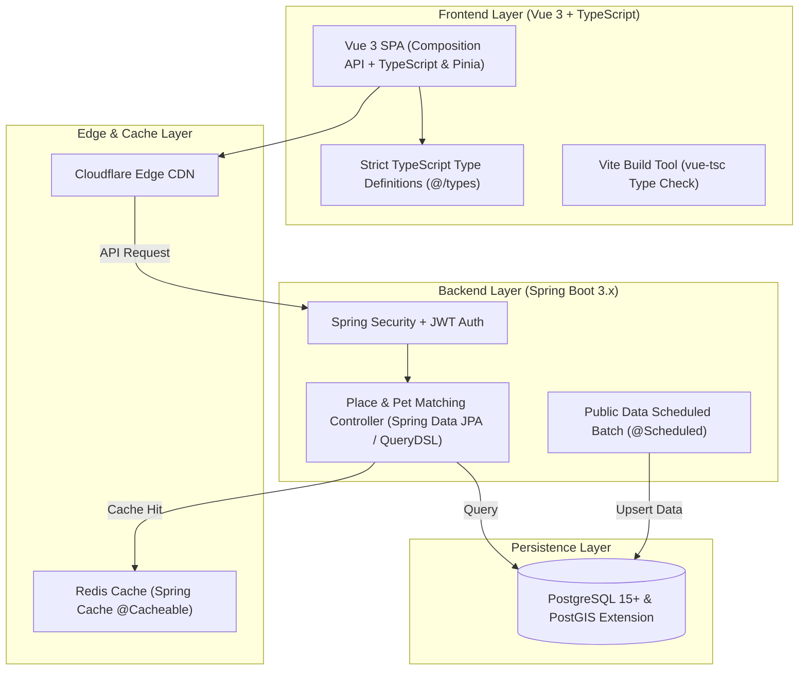

# Technology Stack & Architecture (TECH_STACK.md)

## 1. Core Architecture Pattern
Vue 3 + TypeScript Frontend Client + Spring Boot 3 Backend REST API Layer + PostgreSQL (PostGIS) Data Layer.

---

## 2. Technical Stack Selection Specification

### 2.1 Frontend Stack (Vue 3 + TypeScript Ecosystem)
- **Language**: **TypeScript 5.x** (Strict Type-Checking, No `any` Policy)
- **Framework**: **Vue 3** (Composition API, `<script setup lang="ts">` Syntax)
- **Build Tool**: **Vite** + `vue-tsc` (Type checking & Bundle Optimization)
- **State Management**: **Pinia** (Type-safe Stores for User Session, Active Pet & Filters)
- **Routing**: **Vue Router 4** (Typed Router & Navigation Guards)
- **UI & Styling**: Vanilla CSS / Scoped CSS with Design System Tokens (`variables.css`), Responsive Split View & Mobile Bottom Sheet Components.
- **Map & Icons**: Leaflet.js (`@types/leaflet` Type Definitions) / Kakao Map JS SDK Type Definitions, Remix Icons (`remixicon`).

### 2.2 Backend Stack (Spring Boot 3.x Ecosystem)
- **Framework**: **Spring Boot 3.2+** (Java 17 / 21 LTS)
- **Security & Auth**: **Spring Security** + Stateless **JWT (JSON Web Token)**
- **Data Access Layer**: **Spring Data JPA** + **QueryDSL** (Dynamic Multi-filter Querying)
- **Spatial Engine**: **Hibernate Spatial** (`org.hibernate.spatial`) + PostgreSQL **PostGIS**
- **Batch & Scheduling**: Spring Batch / Spring `@Scheduled` (공공데이터 포털 Open API 수집 파이프라인)
- **Caching Layer**: **Spring Cache** abstraction integrated with **Redis**
- **Build & Dependency**: Gradle (Kotlin DSL / Groovy)

### 2.3 Database & Storage Layer
- **Relational Database**: **PostgreSQL 15+**
- **Spatial Extension**: **PostGIS** (`GEOMETRY(Point, 4326)` 위도/경도 Spatial Indexing)
- **In-Memory Cache**: **Redis** (Spring Cache & Refresh Token Store)

### 2.4 Performance & Reliability NFR Target
- **Query Latency**: 반경 거리 인덱싱 쿼리 **P95 < 50ms**, **P99 < 120ms**
- **SLA**: **99.99% 가동률** (공공데이터 API 서버 장애 시에도 Local PostGIS Fallback)
